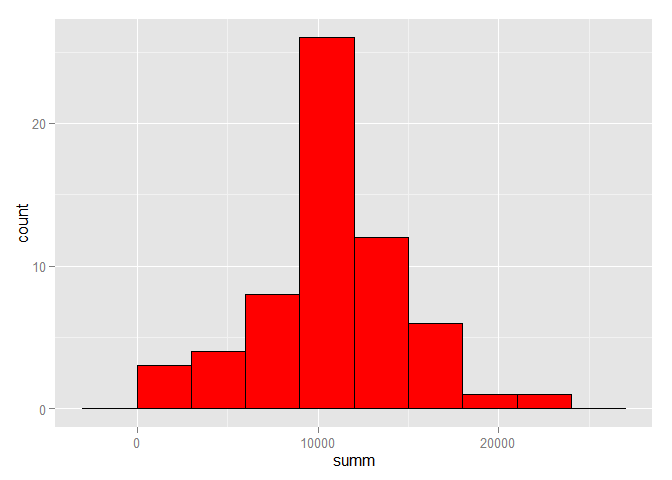

# Reproducible Research: Peer Assessment 1


## Loading and preprocessing the data

```r
library(dplyr)
unzip(zipfile="activity.zip")
data <- tbl_df(read.csv("activity.csv")) %>% mutate(date=as.Date(date))
```

## What is mean total number of steps taken per day?

```r
library(ggplot2)
steps_per_day <- filter(data, !is.na(steps)) %>% group_by(date) %>% summarise(summ=sum(steps))
print(ggplot(steps_per_day, aes(x=summ))+geom_histogram(binwidth=3000, fill="red", color="black"))
```

 

Mean steps per day is 37.3825996.
Median steps per day is 0.

## What is the average daily activity pattern?

```r
steps_per_interval <- filter(data, !is.na(steps)) %>% group_by(interval) %>% summarise(avg=mean(steps))
print(ggplot(steps_per_interval, aes(y=avg, x=interval))+geom_line())
```

 

Interval containing the highest average across all days: 835

## Imputing missing values
There are a total of 2304 rows with missing values.

Filling out missing values with mean values of that 5-minute interval.

```r
data_filled <- left_join(data, steps_per_interval, by="interval") %>% 
  mutate(steps=ifelse(is.na(steps), avg, steps)) %>% 
  select(steps, date, interval)
```

Histogram of the total number of steps taken each day:

```r
steps_per_day <- filter(data_filled, !is.na(steps)) %>% group_by(date) %>% summarise(summ=sum(steps))
print(ggplot(steps_per_day, aes(x=summ))+geom_histogram(binwidth=3000, fill="red", color="black"))
```

 

Mean steps per day is 37.3825996.
Median steps per day is 0.

Mean and median are not affected.

## Are there differences in activity patterns between weekdays and weekends?

```r
data_weekdays <- filter(data, !is.na(steps)) %>%
  mutate(daynum=as.POSIXlt(date)$wday) %>% 
  mutate(weekday=ifelse(daynum==0 | daynum==6, "weekend", "weekday")) %>%
  group_by(interval, weekday) %>% summarise(avg=mean(steps))
print(ggplot(data_weekdays, aes(x=interval, y=avg))+facet_grid(. ~ weekday)+geom_line())
```

 
